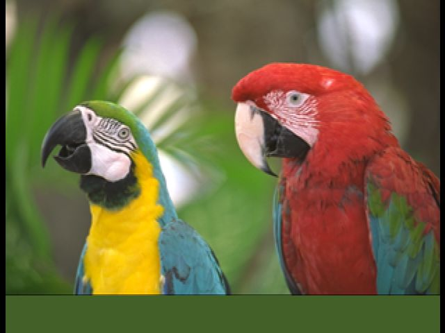
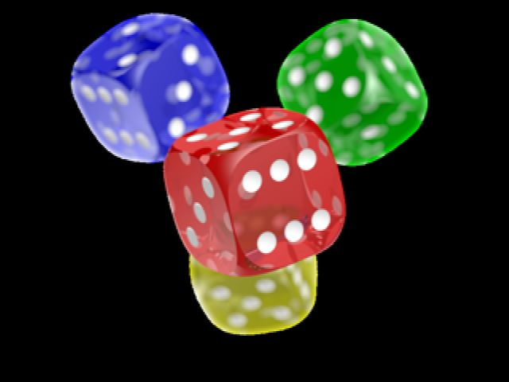

# N64 QOI Viewer

An image viewer that loads QOI images on N64




## How to View Images on N64 QOI Viewer
The maximum supported width is 320px and the maximum supported height is 240px.
This step assumes you have FFMPEG installed.
1. Encode your image into QOI using the following commands. The ones in <> are changeable
```bash
ffmpeg -i <input file to image> -pix_fmt <rgb24 or rgba> -s <width>x<height> <output file to image>.qoi
```

For pixel art, the flags will scale the image using the nearest neighbor flag: `-sws_flags neighbor`
This is useful for scaling up pixel art images

2. Place the encoded QOI images into the filesystem folder. make will include these images in the filesystem folder into built ROM.

3. Change the names array and name_arr_size the amount in src/main.c
```c
// files to load from filesystem
char* names[] = {
    "rom:/location_of_your_qoi_image.qoi"
}; // ...

int name_arr_size = 14; // change this line to match the amount of images

// ...
```
## How to Build N64 QOI Viewer
This tutorial assumes you have your N64 Toolchain set up including GCC for MIPS.
Make sure you are on the preview branch of libdragon.

Clone this repository with `--recurse-submodules` or if you haven't run:

```bash

git submodule update --init
```
---
Initialize libdragon:
```bash
libdragon init
```
Then run make to build this project:

```bash
libdragon make
```

---

## Licenses

Everything in the src folder is licensed under MIT License

In the filesystem folder the following images are in the public domain:
- qrcode.qoi
- smpte_color_bars.qoi
- ebu_colour_bars.qoi

The rest of the images in the filesystem folder are under their respective licenses
